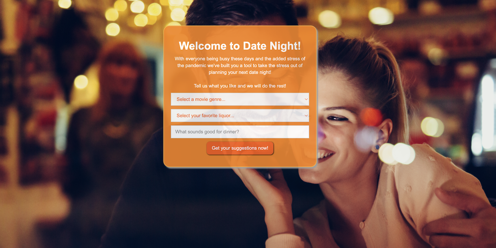

# Date Night

## Description

This program is designed ot help get users plan an amazing Date Night!  The application will give users a movie suggestion, drink suggestion and dinner suggestion to include recipes.

## Technologies Used

HTML, CSS, javascript, git, jquery, webflow, TheMovieDB.com API, TheDrinkDB.com API and Spoonacular.com API

## Usage

Users enter a movie genre, favorite liquor and dinner category they want and the application will does the rest!  The application takes the users inputs and returns a movie, drink and recipe suggestion.

## User Story

* As a user I want to plan a date night for my partner and I.  I want to enter a movie genre, my favorite liquor and favorite cuisine and get everything I need for my date night.  A movie suggestion, drink suggestion and dinner recipe suggestion to include the recipe. 

## Acceptance Criteria

* GIVEN I want to plan a date night with a movie, drink and dinner suggestion
* WHEN I open the Dat Night web application
* THEN a form with a genre selection, liquor selection and cuisine selection are presented
* WHEN enter my selections
* THEN I am presented with a movie suggestion, drink suggestion and dinner recipe suggestion to include images, details and recipe information for the drink and dinner suggestion
* WHEN I return to the site my previous selections are saved and displayed

## Screenshot

## Credits

* Group 7 team: 
  Rebecca Dearry
  Devin Garcia
  Colin McElhatton
  Chinua Robinson
  Jessica Wang
* tackoverflow, my tutor Alexis and github for help and reference.
* Built by Group 7
* Contact: support@group7.com

## Link to deployed page

[Colin Code Quiz Link - Click here!]( https://mcelhatton.github.io/happyHour)